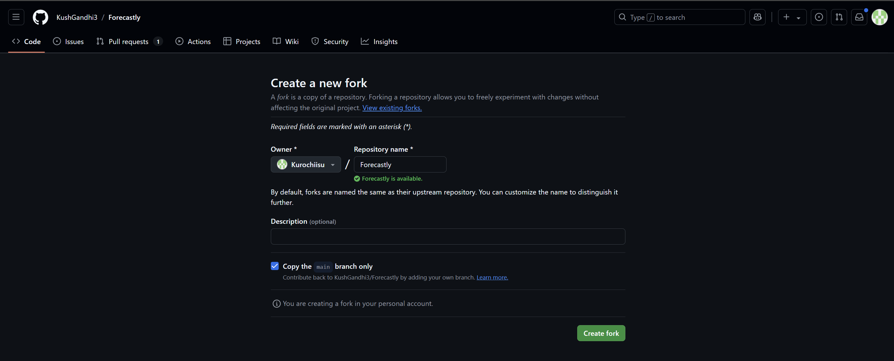

# Contribution Guidlines

Thank you for your interest in contributing to Forecastly! Your help is essential to improving the project and making it better for everyone. Follow these steps to get started:

## Fork the Repository
1. Navigate to the [Forecastly repository](https://github.com/KushGandhi3/Forecastly).
2. Click on the "Fork" button in the upper right corner to create a copy of the repository in your GitHub account.

3. Clone your forked repository to your local IDE. Type this into the terminal and replace 
your_username with your git username. \
```bash git clone https://github.com/your-username/forecastly```
4. Create a new branch for your changes. Type this into the terminal and replace
  your-branch-name with your desired branch name. \
```bash git checkout -b your-branch-name```

## Make Changes
1. Make your desired changes to the project.
2. Ensure your changes are in line with the project's 
guidelines and coding standards. Also ensure code 
formatting consistency with Checkstyle.

## Submit a Pull Request
1. Once you have made your changes, push your branch to your forked repository. \
```bash git push origin your-branch-name```
2. Go to the [Forecastly repository](https://github.com/KushGandhi3/Forecastly) and click on the "New Pull Request" button.
3. Select your branch from the forked repository to compare changes.
4. Add a title and description to your pull request, 
explaining the changes you made. Also show the test 
evidence (screenshots, test results, etc) to show that the 
code works as expected.

## What Makes a Good Pull Request?
- **Descriptive Title**: Clearly describe the changes made in the pull request.
- **Detailed Description**: Provide a detailed explanation of the changes made and why they are necessary.
- **Test Evidence**: Include screenshots, test results, or other evidence to show that the code works as expected.
- **Code Quality**: Ensure that the code follows the project's guidelines, coding standards, and Checkstyle.

## Review Protocols
1. At least one project maintainers will review your pull request.
2. The code will be reviewed for quality, functionality, and adherence to project guidelines.
3. You may be asked to make changes or improvements before your pull request is accepted.